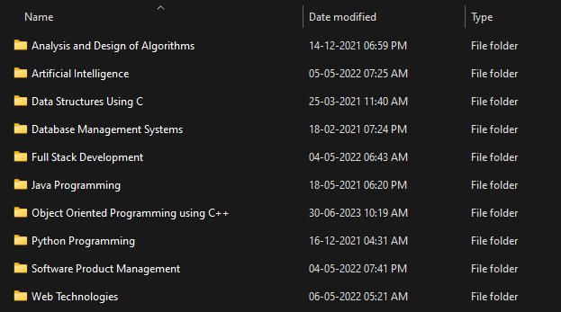

<!-- Improved compatibility of back to top link: See: https://github.com/othneildrew/Best-README-Template/pull/73 -->

<!--
*** Thanks for checking out the Best-README-Template. If you have a suggestion
*** that would make this better, please fork the repo and create a pull request
*** or simply open an issue with the tag "enhancement".
*** Don't forget to give the project a star!
*** Thanks again! Now go create something AMAZING! :D
-->

<!-- PROJECT SHIELDS -->
<!--
*** I'm using markdown "reference style" links for readability.
*** Reference links are enclosed in brackets [ ] instead of parentheses ( ).
*** See the bottom of this document for the declaration of the reference variables
*** for contributors-url, forks-url, etc. This is an optional, concise syntax you may use.
*** https://www.markdownguide.org/basic-syntax/#reference-style-links
-->
[![Contributors][contributors-shield]][contributors-url]
[![Forks][forks-shield]][forks-url]
[![Stargazers][stars-shield]][stars-url]
[![Issues][issues-shield]][issues-url]
[![MIT License][license-shield]][license-url]
[![LinkedIn][linkedin-shield]][linkedin-url]

<!-- PROJECT LOGO -->
 

  

<h3 align="center">My B.Tech Lab Projects</h3>

  

Welcome to my GitHub repository featuring a collection of lab projects completed during my B.Tech at Amity University. This repository showcases projects from various courses, such as Algorithms, Database Management, Data Structures, Full Stack Development, Java, Python, C++, Software Product Management, and Web Technologies. Explore the code and documentation to witness my growth as a software engineer. Your feedback and collaboration are most welcome!
     
    <a href="https://github.com/knowgaurav/btech-lab-projects">View Demo</a>
    ·
    <a href="https://github.com/knowgaurav/btech-lab-projects/issues">Report Bug</a>
    ·
    <a href="https://github.com/knowgaurav/btech-lab-projects/issues">Request Feature</a>
  

<!-- TABLE OF CONTENTS -->

  
Table of Contents

  <ol>
    <li>
      <a href="#about-the-project">About The Project</a>
      <ul>
        <li><a href="#built-with">Built With</a></li>
      </ul>
    </li>
    <li><a href="#usage">About</a></li>
    <li><a href="#license">License</a></li>
    <li><a href="#contact">Contact</a></li>
    <li><a href="#acknowledgments">Acknowledgments</a></li>
  </ol>

<!-- ABOUT THE PROJECT -->
## About The Project

  

(<a href="#readme-top">back to top</a>)

### Built With

* 
* [![Cpp][C++]][C++-url]
* 
* 
* 
* 
* 
* 
* 
* 
* 
* 
* 
* 

(<a href="#readme-top">back to top</a>)

<!-- GETTING STARTED -->
## Details

Welcome to my GitHub repository showcasing the culmination of four years of dedication and hard work during my B.Tech journey at Amity University. Within this repository, you'll find a diverse collection of lab projects spanning multiple courses that have shaped my technical expertise and problem-solving skills.

### Repository: My B.Tech Lab Projects

As an enthusiastic learner and passionate technologist, I immersed myself in various domains, and this repository stands as a testament to my academic endeavors. The projects contained herein represent a wide array of subjects, ranging from fundamental data structures to advanced web technologies. Each project demonstrates my proficiency in handling diverse technologies and applying them to real-world scenarios.

#### Courses and Projects Included:

1. **Analysis and Design of Algorithms**: Delving into the realm of algorithms, I have designed and implemented efficient solutions to complex computational problems. These projects showcase algorithmic creativity and analysis to optimize performance.

2. **Artificial Intelligence**: In this course, I explored various heuristic and non-heuristic based AI approaches. My projects in this domain demonstrate my understanding of AI techniques and their applications.

3. **Database Management Systems**: In this course, I explored the foundations of database design and management. My projects highlight skills in database querying, normalization, and implementation.

4. **Data Structures Using C**: Building on the basics of C programming, I have crafted projects that demonstrate my understanding and implementation of essential data structures.

5. **Full Stack Development**: Embracing the full stack approach, I have worked on projects that integrate front-end and back-end technologies to create dynamic and user-friendly web applications.

6. **Java Programming**: My Java projects exhibit the versatility of the language and my proficiency in building robust and scalable applications.

7. **Object-Oriented Programming using C++**: Through these projects, I have honed my object-oriented design skills in C++ and showcased the power of abstraction and encapsulation.

8. **Python Programming**: I have explored the Python language and utilized it in diverse projects, showcasing its simplicity and effectiveness in various scenarios.

9. **Software Product Management**: These projects reflect my understanding of product development, including requirements gathering, prototyping, and agile project management.

10. **Web Technologies**: Exploring the vast world of web technologies, my projects cover HTML, CSS, JavaScript, and frameworks, underscoring my ability to create interactive and visually appealing web pages.

The repository serves as both a testament to my growth as a software engineer and a resource for fellow enthusiasts and potential collaborators. The code and documentation provided for each project offer insights into my problem-solving approach and technical prowess.

Feel free to explore the projects, review the code, and delve into the detailed documentation. I welcome any feedback, suggestions, or collaboration opportunities that arise from this endeavor.

Thank you for visiting my repository, and I hope my work inspires and contributes to the ever-evolving landscape of technology and innovation.

(<a href="#readme-top">back to top</a>)

<!-- LICENSE -->
## License

Distributed under the MIT License. See `LICENSE.txt` for more information.

(<a href="#readme-top">back to top</a>)

<!-- CONTACT -->
## Contact

Gaurav Singh - [@knowgaurav01](https://twitter.com/knowgaurav01) - hello@sgaurav.me

Project Link: [https://github.com/knowgaurav/btech-lab-projects](https://github.com/github_username/interview-prep)

(<a href="#readme-top">back to top</a>)

<!-- ACKNOWLEDGMENTS -->
## Acknowledgments

* [Amity B.Tech (IT) Course Structure](https://www.amity.edu/admission/course_structure/A23053.html)

(<a href="#readme-top">back to top</a>)

<!-- MARKDOWN LINKS & IMAGES -->
<!-- https://www.markdownguide.org/basic-syntax/#reference-style-links -->
[contributors-shield]: https://img.shields.io/github/contributors/knowgaurav/btech-lab-projects.svg?style=for-the-badge
[contributors-url]: https://github.com/knowgaurav/btech-lab-projects/graphs/contributors
[forks-shield]: https://img.shields.io/github/forks/knowgaurav/btech-lab-projects.svg?style=for-the-badge
[forks-url]: https://github.com/knowgaurav/btech-lab-projects/network/members
[stars-shield]: https://img.shields.io/github/stars/knowgaurav/btech-lab-projects.svg?style=for-the-badge
[stars-url]: https://github.com/knowgaurav/btech-lab-projects/stargazers
[issues-shield]: https://img.shields.io/github/issues/knowgaurav/btech-lab-projects.svg?style=for-the-badge
[issues-url]: https://github.com/knowgaurav/btech-lab-projects/issues
[license-shield]: https://img.shields.io/github/license/knowgaurav/btech-lab-projects.svg?style=for-the-badge
[license-url]: https://github.com/knowgaurav/btech-lab-projects/blob/master/LICENSE.txt
[linkedin-shield]: https://img.shields.io/badge/-LinkedIn-black.svg?style=for-the-badge&logo=linkedin&colorB=555
[linkedin-url]: https://in.linkedin.com/in/knowgaurav
[product-screenshot]: images/screenshot.png
[Next.js]: https://img.shields.io/badge/next.js-000000?style=for-the-badge&logo=nextdotjs&logoColor=white
[Next-url]: https://nextjs.org/
[React.js]: https://img.shields.io/badge/React-20232A?style=for-the-badge&logo=react&logoColor=61DAFB
[React-url]: https://reactjs.org/
[Vue.js]: https://img.shields.io/badge/Vue.js-35495E?style=for-the-badge&logo=vuedotjs&logoColor=4FC08D
[Vue-url]: https://vuejs.org/
[Angular.io]: https://img.shields.io/badge/Angular-DD0031?style=for-the-badge&logo=angular&logoColor=white
[Angular-url]: https://angular.io/
[Svelte.dev]: https://img.shields.io/badge/Svelte-4A4A55?style=for-the-badge&logo=svelte&logoColor=FF3E00
[Svelte-url]: https://svelte.dev/
[Laravel.com]: https://img.shields.io/badge/Laravel-FF2D20?style=for-the-badge&logo=laravel&logoColor=white
[Laravel-url]: https://laravel.com
[Bootstrap.com]: https://img.shields.io/badge/Bootstrap-563D7C?style=for-the-badge&logo=bootstrap&logoColor=white
[Bootstrap-url]: https://getbootstrap.com
[JQuery.com]: https://img.shields.io/badge/jQuery-0769AD?style=for-the-badge&logo=jquery&logoColor=white
[JQuery-url]: https://jquery.com 
[C++]: https://img.shields.io/badge/c++-%2300599C.svg?style=for-the-badge&logo=c%2B%2B&logoColor=white
[C++-url]: https://isocpp.org/
[Codeforces]: https://img.shields.io/badge/Codeforces-445f9d?style=for-the-badge&logo=Codeforces&logoColor=white
[Codeforces-url]: https://codeforces.com/
[LeetCode]: https://img.shields.io/badge/LeetCode-000000?style=for-the-badge&logo=LeetCode&logoColor=#d16c06
[LeetCode-url]: https://leetcode.com
